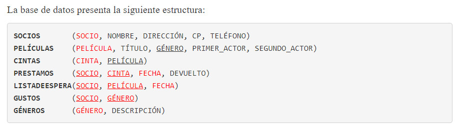

# Base de Datos VideoClub 


# Consideraciones 
Según he comprobado en algunas documentaciones y ejemplos en internet, en las asignaciones se mantienen los nombres de los campos referenciando a la tabla original. Ejemplo: 
```
Asignacion_Ejemplo = Prestamos 
 σ Prestamos.Socio = 1 (Asignacion_Ejemplo)
 
```

Para esta práctica he trabajado siguiendo esa filosofía. 

# Ejercicios

## Obtener el listado de los socios que vivan en las direcciones correspondientes al código postal 15001. (SOCIO, NOMBRE, DIRECCIÓN)

```
π Socio,Nombre,Direccion ( σ CP=15001 ( Socios ) ) 
 
```

## Obtener los dramas que haya protagonizado Robin Williams, o fuese segundo actor. (PELÍCULA, TÍTULO) 

```
π Pelicula,Titulo ( σ Generos.Descripcion = 'Drama' ( σ Peliculas.Genero = Generos.Genero ∧ ((Primer_Actor = 'Robin Williams' ∨ Segundo_Actor = 'Robin Williams')) (Peliculas ⨯ Generos))) 
 
```

## Obtener el listado de películas nunca alquiladas. (PELÍCULA, TÍTULO)

```
Peliculas_Alquiladas= πPelicula ( σ Cintas.Cinta=Prestamos.Cinta (Cintas ⨯ Prestamos)) 
Todas_Peliculas= πPelicula (Peliculas) 
Peliculas_No_Alquiladas= Todas_Peliculas - Peliculas_Alquiladas 
π Peliculas.Pelicula, Peliculas.Titulo ( Peliculas ⨝ Peliculas_No_Alquiladas ) 

```

## Obtener un listado de los actores (principales o secundarios) de películas que nunca hayan sido alquiladas. (NOMBRE_ACTOR) 

```

Cintas_Alquiladas = π Cintas.Pelicula σ Cintas.Cinta = Prestamos.Cinta (Cintas ⨯ Prestamos) 
Peliculas_NoAlquiladas = (π Peliculas.Pelicula (Peliculas) - Cintas_Alquiladas) ⨝ Peliculas 
π Primer_Actor Peliculas_NoAlquiladas ∪ π Segundo_Actor Peliculas_NoAlquiladas 

```

## Obtener el listado de películas en la lista de espera. (PELÍCULA, TÍTULO) 

```
π Pelicula , Titulo ( Peliculas ⨝ ListaDeEspera)

```

## Obtener los datos del socio o socios que han tomado prestadas películas del actor Alfredo Landa. (SOCIO, NOMBRE) 

```
Socios_Alquilaron = Socios ⨝ Prestamos 
Alquilaron_Cintas = σ Cintas.Cinta = Prestamos.Cinta (Socios_Alquilaron ⨯ Cintas) 
Pelis_Landa =  σ Peliculas.Primer_Actor = 'Alfredo Landa' ∨ Peliculas.Segundo_Actor = 'Alfredo Landa' Peliculas 
π Socios.Socio, Socios.Nombre σ Cintas.Pelicula=Peliculas.Pelicula (Alquilaron_Cintas ⨯ Pelis_Landa)

```

## Obtener un listado de títulos de películas de los géneros que le gustan al socio cuyo código es 194 y que todavía no ha alquilado. (TÍTULO)
```
Lista_Generos = π Genero σ Socio=1  Gustos 
Pelis_Del_Genero= π Titulo σ Gustos.Genero = Peliculas.Genero (Peliculas ⨯ Lista_Generos)  
Pelis_Alquiladas = π Titulo (σ Socio=1 ∧ Cintas.Cinta = Prestamos.Cinta ((Peliculas  ⨝ Cintas.Pelicula = Peliculas.Pelicula Cintas) ⨯  Prestamos)) 
Pelis_Del_Genero - Pelis_Alquiladas 
```

## Obtener nombre y teléfono del socio o socios que han tomado prestadas todas las películas de la actriz Ariadna Gil. (NOMBRE, TELÉFONO) 

```
Pelis_Ariadna = π Pelicula ( σ Primer_Actor='Ariadna Gil' ∨ Segundo_Actor='Ariadna Gil' ( Peliculas ) ) 
Cintas_Alquiladas = π Pelicula, Socio σ Cintas.Cinta = Prestamos.Cinta (Cintas ⨯ Prestamos) 
Socios_Alquilaron = Cintas_Alquiladas ÷ Pelis_Ariadna 
π Nombre,Telefono ( Socios_Alquilaron ⨝ Socios ) 

```

## Obtener una lista de los socios junto con los títulos de las películas que tienen prestadas desde hace más de 3 días y para las que hay lista de espera. Puedes usar la función hoy(). (NOMBRE, TELÉFONO, TITULO) 

```

Peliculas_Pasadas_DeFecha= π Pelicula σ hoy() - Prestamos.Fecha > 3  ∧ Prestamos.Devuelto = false ∧ Prestamos.Cinta = Cintas.Cinta (Prestamos ⨯ Cintas)  
Pelis_Espera = σ ListaDeEspera.Pelicula = Peliculas.Pelicula ( ( σ Cintas.Pelicula = ListaDeEspera.Pelicula (( Peliculas_Pasadas_DeFecha ∩ π Pelicula ListaDeEspera) ⨯ ListaDeEspera) ) ⨯ Peliculas) 
π Socios.Nombre, Socios.Telefono, Peliculas.Titulo σ Socios.Socio = ListaDeEspera.Socio ( Pelis_Espera ⨯ Socios)

```

## Obtener el nombre y el teléfono de los socios que están en la lista de espera de una película del actor Jorge Sanz o que tienen actualmente prestada alguna película de dicho actor. (NOMBRE, TELÉFONO)

```
Socios_Espera = π ListaDeEspera.Socio σ Peliculas.Pelicula = ListaDeEspera.Pelicula ∧ (Primer_Actor = 'Jorge Sanz' ∨ Segundo_Actor = 'Jorge Sanz') (ListaDeEspera ⨯ Peliculas) 
Socios_Alquiler = π Prestamos.Socio σ Prestamos.Cinta = Cintas.Cinta ((( σ Peliculas.Pelicula = Cintas.Pelicula ∧ (Primer_Actor = 'Jorge Sanz' ∨ Segundo_Actor = 'Jorge Sanz') (Cintas ⨯ Peliculas)) ⨯  Prestamos)) 
Todos_Socios = Socios_Espera ∪ Socios_Alquiler  
π Socios.Nombre, Socios.Telefono (Todos_Socios ⨝ Socios)
```


 
