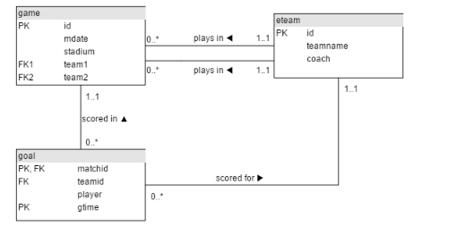

----------------------------
## SELECT
### AS
Sirve para poner alias en los campos, de manera que sea mas facil identificar el tipo de info que contienen.
```SQL
	SELECT name, continent as 'Continente', population FROM world
```
### Operaciones en Select
Se pueden realizar operaciones en el propio select (Recomendable usar Alias para que quede claro que hace).

PIB por persona:

```SQL
Select name, gdp/population as 'GDP Per Capita'
		  FROM world
			WHERE population >= 200000000
```
Continente Sudamerica, con población en Millones:

```SQL
SELECT name, population/1000000 as "Millones de Personas"
	FROM world
	WHERE continent = 'South America'
```

## Condiciones con WHERE
Nos permite filtrar el contenido de una consulta, obteniendo solo los que cumplen ciertos valores. 
```SQL
	SELECT name FROM world
	WHERE population>=200000000
```
	
## AND 
Nos permite obtener filas que cumplen dos condiciones
```SQL
SELECT yr, subject, winner
  FROM nobel
 WHERE yr = 1950
```
## OR
Nos permite obtener las filas que cumplen una condicion, la otra o las dos.

```SQL
SELECT name, population, area
FROM world
WHERE area > 3000000 OR population > 250000000
```

## XOR
Nos permite obtener las filas que cumplen una condicion, la otra, pero no las dos.

```SQL
SELECT name, population, area
FROM world
WHERE area > 3000000 XOR population > 250000000
```
Seria el equivalente a la siguiente consulta:
```SQL
SELECT name, population, area
FROM world
WHERE (area > 3000000 OR population > 250000000) AND NOT ( area > 3000000 AND population > 250000000)
```

## Combinacion de Condiciones
Evidentemente se pueden combinar un conjunto de ANDs y ORs para obtener el resultado deseado. En el ejemplo se obtienen los ganadores del nobel de quimica en 1984 o los que ganaron el de física en 1980
```SQL
SELECT yr, subject, winner
FROM nobel
WHERE (subject = 'Physics' AND yr=1980) OR (subject = 'Chemistry' AND yr=1984)
```
## IN
Permite filtrar filas cuyo campo esté en uno de los valores contenidos dentro de la clausula.
```SQL
SELECT name, population
FROM world
WHERE name IN ('France', 'Germany', 'Italy');
```

Como devuelve 1 (Si se cumple) y 0(Si no se cumple), se puede usar para ordenar campos (Ultimos los que lo cumplan por ejemplo):
```SQL
SELECT winner, subject
  FROM nobel
 WHERE yr=1984
 ORDER BY subject IN ('Physics','Chemistry') ASC, subject, winner;
```
## LIKE
Nos permite filtrar por  campos que cumplen un patron determinado
```SQL
SELECT name
FROM world
WHERE name LIKE '%United%'
```
Los paises que tienen todas las vocales, sin espacios:

```SQL
SELECT name
   FROM world
WHERE name LIKE '%a%' AND name LIKE '%e%' AND name LIKE '%i%' AND name LIKE '%o%' AND name LIKE '%u%'
  AND name NOT LIKE '% %';
```
### Caracteres de LIKE
**_** - Caracter único (Si necesitamos 4, pues 4 guiones bajos)
**%** - Cualquier cosa
## CONCAT
	Select capital, name
	FROM world
	WHERE capital LIKE CONCAT(name,'_%');

Basicamente muestra capital y nombre de aquellos paises cuya capital es el nombre mas algo mas...

## REPLACE
Reemplaza caracteres por otro indicado.

Replace (Campo, 'Caracter_a_Remplazar', 'Caracter_Sustituyente') - En la capital sustituye el nombre del pais por cadena vacia (De manera que solo nos queda la extension).


	*Select name, REPLACE (Capital, name, '') AS Extension
	FROM world
	WHERE capital LIKE CONCAT(name,'_%');*

## ROUND
Nos permite redondear un numero a X decimales.

```SQL
SELECT name, ROUND(population/1000000, 2) as 'Poblacion Millones', ROUND(gdp/1000000000,2) as 'Billones PB'
FROM world
WHERE continent = 'South America'
```
Lo podemos usar para redondear el resultado a unidades, decenas, centenas...
 ```SQL
 SELECT name, ROUND(gdp/population, -3) as 'PIB per Capita'
FROM world
WHERE gdp>1000000000000
```


## LENGTH
Nos permite obtener la longitud de un campo
```SQL
SELECT name, capital
  FROM world
 WHERE LENGTH(name) = LENGTH(capital);
```
## LEFT
Permite extraer x caracteres de un String.

En el siguiente ejercicio, se cogen los países cuyo nombre y nombre de capital empiezan por la misma letra, siendo sus nombres distintos (<> Operador de desigualdad)

```SQL
SELECT name, capital
FROM world
WHERE LEFT(name,1) = LEFT(capital,1) AND name<>capital
```

## NOT
Básicamente ignora aquellas filas que cumplan la condicion. Por ejemplo, aquellos premios que no sean de quimica y medicina:
```SQL
SELECT yr, subject, winner
FROM nobel
WHERE yr = 1980 AND subject NOT IN ('Chemistry', 'Medicine')
```
## SELECTS Anidados
Nos permiten filtrar una consulta usando resultados de otras consultas internas.

```SQL
SELECT name 
FROM world
WHERE continent = 'europe' AND gdp/population >(        SELECT gdp/population 
         FROM world 
         WHERE name = 'United Kingdom')
```
### Combinado con IN, AND, CONCAT....
Si el select interno devuelve mas de una fila, podemos usar in para comprobar que está dentro
```SQL
SELECT name, continent
FROM world
WHERE continent in (
	SELECT continent FROM world 
	WHERE name = 'Argentina' 
	OR name ='Australia')
ORDER BY name;
```
Podemos utilizar ANDs y utilizar otro select adicional
```SQL
SELECT name, population FROM world
WHERE population > (
	SELECT population 
	FROM world 
	WHERE name='Canada') 
AND population < (
		SELECT population 
		FROM world 
		WHERE name='Poland')
```
Podemos usar un select en el propio select (Combinado con concat y redondeo)
```SQL
SELECT name, CONCAT (
	ROUND (population/(
		SELECT population 
		FROM world 
		WHERE name='Germany') 
	*100)
	,'%')
FROM world
WHERE continent = 'Europe'
```
## ALL
Es una clasula que comprueba si una condición se cumple en todas las filas. (En este caso, busca el nombre del pais cuyo gdp es mayor a todos los de Europa).

Es importante la clausula is not null, ya que a veces petardea.
```SQL
SELECT name
FROM world
WHERE gdp > ALL(
	SELECT gdp FROM world WHERE continent = 	
	'Europe' AND gdp IS NOT NULL) ;
```
## Alias para las Tablas
Podemos comparar las tablas de dos selects usando alias para cada consulta
```SQL
SELECT continent, name
FROM world x
WHERE name <= ALL(
	SELECT name FROM world y 
	WHERE x.continent=y.continent)
```
Si no usaramos alias, comparariamos el continente con el de la misma consulta , y la consulta haría cualquier cosa...

```SQL
SELECT continent, name, area FROM world x
  WHERE area>= ALL
    (SELECT area FROM world y
        WHERE y.continent=x.continent
          AND area IS NOT NULL);
```

```SQL
SELECT continent, name
FROM world x
WHERE name <= ALL(SELECT name FROM world y 
WHERE x.continent=y.continent)
```
Esto sería lo mismo que la anterior:
```SQL
SELECT continent, name
FROM world x
WHERE name < ALL(SELECT name FROM world y 
WHERE x.continent=y.continent
AND x.name <> y.name)
```
En la primera ponemos >= que nombre para incluir que el pais alfabéticamente menor también cumpla la función. Una manera de hacer lo mismo solo con >, es excluyendo al pais de mismo nombre en la propia consulta interna.

Tenemos que sacar los paises de los continentes donde todos los países tienen mas de 25000000: 

```SQL
SELECT name, continent, population
FROM world x
WHERE 25000000 >= ALL(SELECT population 
from world y WHERE x.continent=y.continent)
```

Ahora probamos con dos subconsultas. 

```SQL
SELECT name, continent, population
FROM world WHERE continent IN
	(SELECT continent
	FROM world x
	WHERE 25000000 >= ALL(SELECT population 
	from world y WHERE 	
	x.continent=y.continent)) 
```
La subconsulta mas interna obtiene todos los países del continente a comparar, la posterior filtra solo los continentes donde se cumple la condición, y la tercera muestra todos los países de esos continentes.

Podemos realizar operaciones en los SELECT anidados y condiciones adicionales excluyentes.

```SQL
SELECT name, continent
FROM world x
WHERE population > ALL(
SELECT (population*3) FROM world y
WHERE x.continent=y.continent AND y.name<>x.name)
```
## AGREGADOS
### SUM
Función que suma todos los numeros que le pasamos
```SQL
SELECT SUM(population), SUM(gdp)
  FROM bbc
  WHERE region = 'Europe'
```

```SQL
SELECT SUM(population)
FROM world
WHERE name IN ('Estonia', 'Latvia', 'Lithuania');
```
### COUNT
Función que cuenta el numero de resultados
```SQL
SELECT count(name)
FROM world
WHERE area>1000000;
```
### MAX
Función que devuelve el maximo de un conjunto de resultados
```SQL
SELECT MAX(population)
FROM world;
```
### AVG
Calcula el promedio de un conjunto de resultado
```SQL
SELECT AVG(population)
FROM world
```
## DISTINCT
Devuelve los resultados sin repetidos en un campo concreto
```SQL
SELECT DISTINCT region FROM bbc
```
## GROUP BY
Nos permite agrupar los resultados por un campo concreto. De esta manera se generan subtablas para cada valor del campo agrupado.

Numero de paises por cada continente:
```SQL
SELECT continent, count(name)
FROM world
GROUP BY continent;
```

Numero de paises mayores de 10.000.000 de población en cada continente:
```SQL
SELECT continent, count(name)
FROM world
WHERE population>=10000000
GROUP BY continent;
```
Nombre de cada continente que tiene mas de 10.000.000 de habitantes en total:
```SQL
SELECT continent
FROM world x
WHERE 100000000<=(SELECT SUM(population) FROM world y 
WHERE y.continent=x.continent)
GROUP BY continent;
```
## HAVING
Nos sirve como filtro para el agrupado Group By.

Continentes que tienen una poblacion total de al menos 100 Millones. En este caso usamos el having para filtrar los continentes 
sobre los que agrupamos.
```SQL
SELECT continent
FROM world 
GROUP BY continent
HAVING SUM(population)>=100000000;
```

## JOIN
Hasta ahora estuvimos trabajando con una sola tabla. Para trabajar con multiples tablas necesitamos JOINs que viene a unir dos o mas tablas en una resultante para que operemos con ella.




Ejemplo. Supongamos que queremos los goles de un equipo. Tendriamos algo como esto.
```SQL
SELECT matchid, player
FROM goal
WHERE teamid='GER';
```

```SQL
SELECT matchid, player
FROM goal
JOIN eteam on teamid=id
WHERE teamname='Germany';

```

Ahora supongamos que queremos mostrar todos los goles de alemania en el torneo, mostrando la fecha del partido. Para ello necesitamos unir tablas, de manera que acotando datos podamos mostrar detalles de la tabla gol y la tabla partido.

```SQL
SELECT player, teamid, stadium, mdate
  FROM game JOIN goal ON (id=matchid)
WHERE teamid='GER'
```

Mostrar equipos y jugador para cada gol marcado por alguien llamado mario.
```SQL
SELECT team1, team2, player
  FROM game JOIN goal ON (id=matchid)
WHERE player LIKE 'Mario%'
```

Goles marcados los primeros 10 minutos, mostrando jugador, equipo, entrenador y tiempo:
```SQL
SELECT player, teamid, coach, gtime
  FROM goal JOIN eteam on teamid=id
 WHERE gtime<=10
```

Lista de partidos y nombre de equipo entrenado por fernando santos. Cabe destacar que ambas tablas del join cuentan con un campo ID, con lo cual debemos indicar la tabla a la que estamos referenciando (tabla.campo):

```SQL
SELECT mdate, teamname
FROM game JOIN eteam ON (team1=eteam.id)
WHERE coach='Fernando Santos'
```

Jugadores que han marcado en el estadio de varsovia:
```SQL
SELECT player 
FROM goal JOIN game on matchid=id
WHERE stadium='National Stadium, Warsaw'
```

Mostrar nombre de los jugadores que marcaron a alemania:
```SQL
SELECT DISTINCT(player)
  FROM game JOIN goal ON matchid = id 
    WHERE (team1='GER' OR team2='GER') AND teamid<>'GER'
```

Mostrar equipo y goles metidos por cada uno. Necesitamos agrupar:
```SQL
SELECT teamname, count(*)
FROM eteam JOIN goal ON id=teamid
GROUP BY teamname
ORDER BY teamname
```

Numero de goles marcados en cada estadio:
```SQL
SELECT stadium, count(*) AS 'Goles'
FROM goal JOIN game on matchid=id
GROUP BY stadium
```

Goles marcados en cada partido donde polonia jugo, mostrando id de partido y fecha:
```SQL
SELECT matchid, mdate, COUNT(*) AS 'Goles'
  FROM game JOIN goal ON matchid = id 
 WHERE (team1 = 'POL' OR team2 = 'POL')
GROUP BY matchid, mdate
```

En cada partido con goles de Alemania, mostrar id de partido, fecha y numero de goles alemanes:
```SQL
SELECT matchid, mdate, count(*)
FROM goal JOIN game on matchid=id
WHERE teamid='GER'
GROUP BY matchid, mdate
```
## Curiosidades
### Problemas con los caracteres especiales

 - La comilla simple se referencia como dos comillas simples

```SQL
SELECT *
FROM nobel
WHERE winner like 'Eugene O''Neill';
```
### Consultas Anidadas
 - Las subconsultas han de ir siempre a la derecha de la condición.

### Desigualdades y NOT
Las desigualdades se expresan como <>.
```SQL
WHERE a<>b -- Es lo mismo que
WHERE NOT a = b
```

### WHERE y HAVING
El WHERE se ejecuta sobre la consulta, es decir, la totalidad de las filas obtenidas. El having se aplica sobre las subtablas agrupadas posteriormente.
----------------------------
# Welcome to StackEdit!

Hi! I'm your first Markdown file in **StackEdit**. If you want to learn about StackEdit, you can read me. If you want to play with Markdown, you can edit me. Once you have finished with me, you can create new files by opening the **file explorer** on the left corner of the navigation bar.


# Files

StackEdit stores your files in your browser, which means all your files are automatically saved locally and are accessible **offline!**

## Create files and folders

The file explorer is accessible using the button in left corner of the navigation bar. You can create a new file by clicking the **New file** button in the file explorer. You can also create folders by clicking the **New folder** button.

## Switch to another file

All your files and folders are presented as a tree in the file explorer. You can switch from one to another by clicking a file in the tree.

## Rename a file

You can rename the current file by clicking the file name in the navigation bar or by clicking the **Rename** button in the file explorer.

## Delete a file

You can delete the current file by clicking the **Remove** button in the file explorer. The file will be moved into the **Trash** folder and automatically deleted after 7 days of inactivity.

## Export a file

You can export the current file by clicking **Export to disk** in the menu. You can choose to export the file as plain Markdown, as HTML using a Handlebars template or as a PDF.


# Synchronization

Synchronization is one of the biggest features of StackEdit. It enables you to synchronize any file in your workspace with other files stored in your **Google Drive**, your **Dropbox** and your **GitHub** accounts. This allows you to keep writing on other devices, collaborate with people you share the file with, integrate easily into your workflow... The synchronization mechanism takes place every minute in the background, downloading, merging, and uploading file modifications.

There are two types of synchronization and they can complement each other:

- The workspace synchronization will sync all your files, folders and settings automatically. This will allow you to fetch your workspace on any other device.
	> To start syncing your workspace, just sign in with Google in the menu.

- The file synchronization will keep one file of the workspace synced with one or multiple files in **Google Drive**, **Dropbox** or **GitHub**.
	> Before starting to sync files, you must link an account in the **Synchronize** sub-menu.

## Open a file

You can open a file from **Google Drive**, **Dropbox** or **GitHub** by opening the **Synchronize** sub-menu and clicking **Open from**. Once opened in the workspace, any modification in the file will be automatically synced.

## Save a file

You can save any file of the workspace to **Google Drive**, **Dropbox** or **GitHub** by opening the **Synchronize** sub-menu and clicking **Save on**. Even if a file in the workspace is already synced, you can save it to another location. StackEdit can sync one file with multiple locations and accounts.

## Synchronize a file

Once your file is linked to a synchronized location, StackEdit will periodically synchronize it by downloading/uploading any modification. A merge will be performed if necessary and conflicts will be resolved.

If you just have modified your file and you want to force syncing, click the **Synchronize now** button in the navigation bar.

> **Note:** The **Synchronize now** button is disabled if you have no file to synchronize.

## Manage file synchronization

Since one file can be synced with multiple locations, you can list and manage synchronized locations by clicking **File synchronization** in the **Synchronize** sub-menu. This allows you to list and remove synchronized locations that are linked to your file.


# Publication

Publishing in StackEdit makes it simple for you to publish online your files. Once you're happy with a file, you can publish it to different hosting platforms like **Blogger**, **Dropbox**, **Gist**, **GitHub**, **Google Drive**, **WordPress** and **Zendesk**. With [Handlebars templates](http://handlebarsjs.com/), you have full control over what you export.

> Before starting to publish, you must link an account in the **Publish** sub-menu.

## Publish a File

You can publish your file by opening the **Publish** sub-menu and by clicking **Publish to**. For some locations, you can choose between the following formats:

- Markdown: publish the Markdown text on a website that can interpret it (**GitHub** for instance),
- HTML: publish the file converted to HTML via a Handlebars template (on a blog for example).

## Update a publication

After publishing, StackEdit keeps your file linked to that publication which makes it easy for you to re-publish it. Once you have modified your file and you want to update your publication, click on the **Publish now** button in the navigation bar.

> **Note:** The **Publish now** button is disabled if your file has not been published yet.

## Manage file publication

Since one file can be published to multiple locations, you can list and manage publish locations by clicking **File publication** in the **Publish** sub-menu. This allows you to list and remove publication locations that are linked to your file.


# Markdown extensions

StackEdit extends the standard Markdown syntax by adding extra **Markdown extensions**, providing you with some nice features.

> **ProTip:** You can disable any **Markdown extension** in the **File properties** dialog.


## SmartyPants

SmartyPants converts ASCII punctuation characters into "smart" typographic punctuation HTML entities. For example:

|                |ASCII                          |HTML                         |
|----------------|-------------------------------|-----------------------------|
|Single backticks|`'Isn't this fun?'`            |'Isn't this fun?'            |
|Quotes          |`"Isn't this fun?"`            |"Isn't this fun?"            |
|Dashes          |`-- is en-dash, --- is em-dash`|-- is en-dash, --- is em-dash|


## KaTeX

You can render LaTeX mathematical expressions using [KaTeX](https://khan.github.io/KaTeX/):

The *Gamma function* satisfying $\Gamma(n) = (n-1)!\quad\forall n\in\mathbb N$ is via the Euler integral

$$
\Gamma(z) = \int_0^\infty t^{z-1}e^{-t}dt\,.
$$

> You can find more information about **LaTeX** mathematical expressions [here](http://meta.math.stackexchange.com/questions/5020/mathjax-basic-tutorial-and-quick-reference).


## UML diagrams

You can render UML diagrams using [Mermaid](https://mermaidjs.github.io/). For example, this will produce a sequence diagram:


And this will produce a flow chart:


---------------------------------
**La estructura de una sentencia SQL** 

 1. indicamos las tablas de las cuales vamos a sacar la información.
 2. Indicamos una condición.
 3. Indicamos si queremos un Orden
 4. Indicamos un limite

### SELECCIONAR DE UNA TABLA

Utilizamos la notación **FROM** para indicar la tabla de la cual vamos a recoger información.

SELECT name, population

FROM world   **SELECCIONAMOS DE LA TABLA world**

WHERE name >= 'France'

ORDER BY population ASC

LIMIT 10

### CONJUNTOS
Utilizamos la notación **IN** para los conjuntos, estes van entre paréntesis y en comillas simples y separados por comas.

SELECT name, population 

FROM world

WHERE name IN ('Sweden', 'Norway', 'Denmark');  **SELECCIONAMOS EL CONJUNTO DE ESTES TRES PAÍSES** 

### BETWEEN

Utilizamos esta notación **BETWEEN** para seleccionar un rango de valores intermedios entre dos números

SELECT name, area FROM world

  WHERE area BETWEEN 200000 AND 250000  **SELECCIONA LOS VALORES ENTRE 200000 Y 250000 AMBOS INCLUIDOS** 
  
  
  ### LIKE ( PATTERN MATCHING STRINGS)
  
  Utilizamos esta notación **LIKE** para buscar un patrón / carácter / símbolo  y que coincida
  **En SQL usar Mayúsculas y Minúsculas no es lo mismo. Es estricto el Matching de caracteres.**
  
  SELECT name FROM world
  
  WHERE name LIKE 'B%' **SELECCIONA DE LA TABLA LOS NOMBRES QUE TENGAN UNA B, SE PUEDE PONER %B%, %GER% %Germany%**
  
  ### Finalicen con con un carácter se indica con %char
  
  SELECT name FROM world
  
  WHERE name LIKE 'Y%'
  
   ### Contengan un carácter %char%
  
  SELECT name FROM world
  
  WHERE name LIKE '%x%'
    
   ### Finalicen con varios caracteres(string)
  
  SELECT name FROM world
  
  WHERE name LIKE '%land'
  
   ### Que empiecen con un carácter y terminen con un conjunto de caracteres
  
  SELECT name FROM world
  
  WHERE name LIKE 'C%ia' 
  
   ### Contiene un carácter doble
  
  SELECT name FROM world
  
  WHERE name LIKE '%ee%'
  
   ### Varios caracteres repetidos pero separados 
  
  SELECT name FROM world
  
  WHERE name LIKE '%a%a%a%' **en una lista de países encontraría Bahamas** 
  
 ### Segundo carácter Se utiliza un guion bajo como sustituto de un carácter y solo un carácter 
  
SELECT name 

FROM world

WHERE name LIKE '_t%'  **En una lista de países solo nos mostraría los países que como segundo carácter tienen una t** 

ORDER BY name
  
 ### mismo carácter separado por dos caracteres 
  
SELECT name FROM world

WHERE name LIKE '%o__o%'  **UTILIZAMOS DOS GUIONES BAJOS ENTRE LAS DOS o's PARA BUSCAR PAISES QUE TENGAN DOS SEPARADAS POR DOS CARACTERES** 

 ### Exactamente x números de caracteres

SELECT name FROM world

WHERE name LIKE '____' /* SE UTILIZA UN NUMERO DE GUIONES BAJOS IGUAL AL NUMERO DE CARACTERES PEDIDOS */

 ### NOTA -> si piden como mínimos x letras usamos guiones bajos y un porcentaje '____%' y si solo pide x numero (ej: 4) '____'
 
 ### Exacto mismo nombre en una tabla y en otra

SELECT capital

FROM world

WHERE name LIKE capital  **SE SELECCIONA UN PAÍS DONDE EL NOMBRE DE LA CAPITAL ES EL MISMO QUE EL DEL PAÍS EN VEZ DEL LIKE TAMBIÉN VALE CON =** 

 ### CONCAT 
Usamos la función concat para machear pero añadiendo algún string )
En este ejemplo queremos los países que su capital sea el nombre del país + City 

SELECT name /* SELECCIONAR NOMBRE*/

FROM world /* DESDE LA TABLA world */

WHERE capital LIKE concat(name, ' city')  **DONDE LA CAPITAL ES IGUAL A LA CONCATENACIÓN DEL NOMBRE MAS CITY** 
 
  ### CONCAT Cuando incluye 
 
SELECT capital, name  **FIJARSE EN EL ENUNCIADO POR QUE PIDE CAPITAL Y NAME** 

FROM world

WHERE capital LIKE CONCAT ( '%', name, '%') **CUALQUIER COSA + NOMBRE DE PAÍS + CUALQUIER COSA** 

 ### CONCAT concatenando extensiones a un atributo

SELECT capital, name

FROM world

WHERE capital LIKE CONCAT ( name, '_%')  **ES ASÍ AUN NO SE MUY BIEN POR QUE , CREO QUE ES POR QUE EL GUION BAJO INDICA QUE TIENE QUE HABER ALGO SI O SI ENTRE EL NOMBRE DEL PAÍS Y CUALQUIER COSA** 
