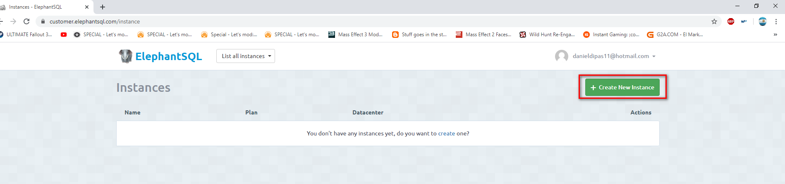
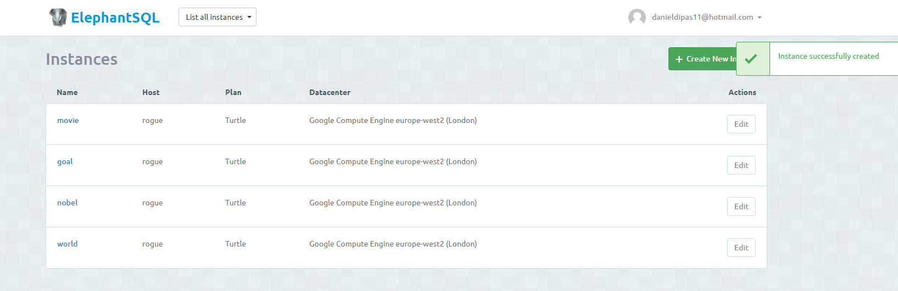

# ELEPHANT SQL

## ¿Que es ElephantSQL?
ElephantSQL es una plataforma de hosting de base de datos, que nos permite trabajar con Bases de datos de PostgreSQL en la nube, mientras el mismo se encarga de la instalación, actualizaciones o copias de seguridad.

[Enlace a ElephantSQL](https://www.elephantsql.com/)

## Creando instancias
Lo primero que tenemos que hacer es crear una cuenta propia. Se nos da opciones como crearla desde cero o incluso vincular una cuenta de GitHub. Una vez creada dicha cuenta, es hora de crear instancias para cada una de las bases de datos que vamos a crear (La idea es copiar aquellas presentes en SQLZOO).

Cada una de estas instancias cuenta con un Plan específico adaptado a nuestras necesidades (Variados capacidad de almacenaiento, velocidad de acceso, conexiones concurrentes, followers...). Para nosotros el plan gratuito es mas que suficiente, pero hemos de tener en cuenta en todo momento que solo contamos con 20MB de almacenamiento y un maximo de cinco conexiones concurrentes.

Una vez seleccionado el plan, es hora de darle nombre a nuestra instancia. Como ya dije antes, creo una instancia por cada base de datos de SQLZOO (world, nobel, movies, goal...). Las etiquetas, si bien útiles cuando se amontonan gran cantidad de instancias distintas agrupadas por temas similares, no las considero necesarias en este caso. 

Es hora de elegir un servicio de hosting. Existen varios disponibles (Amazon, Google, Azure...). El que mas nos guste o mas cercano sea a nuestra zona.

Creada la primera instancia, repetimos el proceso hasta tener las cuatro base de datos de SQLZOO repartidas con una instancia cada una.

