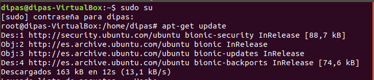
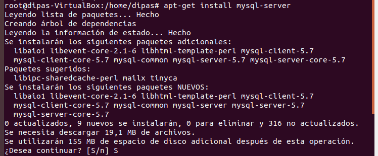
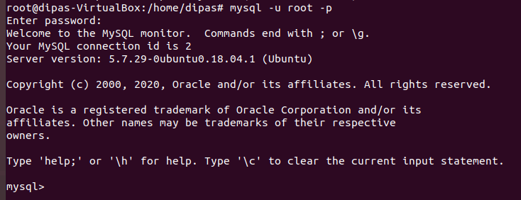

# Indice
- [Instalacion MYSQL](#instalar-mysql-server-en-linux)
- [Crear bases de datos MYSQL](#crear-bases-de-datos-en-mysql)
  - [Base de datos de Investigacion](#base-de-datos-de-investigacion)
  - [Base de datos de Naves Espaciales](#base-de-datos-de-naves-espaciales)

# Instalar MYSQL Server en Linux
Para instalar MYSQL Server lo primero que tenemos que hacer es actualizar la lista de paquetes disponibles en los repositorios:

Una vez hecha dicha actualizacion instalamos el paquete mysql-server, que es el que nos permite trabajar con bases de datos. Instalamos aquellas dependencias que el Linux considere oportunas:

Con MYSQL-Server instalado, ya podemos empezar a trabajar. Para ello, ejecutamos MYSQL como usuario root, dandole la contraseña pertinente:

Ya entramos en el intérprete de comandos de MYSQL, hacemos pruebas creando una base de datos cualquiera:

Comprobamos las bases de datos existentes:

[Volver al Indice](#indice)

# Crear Bases de Datos en MYSQL

## Base de datos de Investigacion

DROP SCHEMA IF EXISTS Proyectos_Investigacion;
 
CREATE SCHEMA Proyectos_Investigacion;

CREATE TABLE Proyectos_Investigacion.Sede (
	Nome_Sede VARCHAR(30) PRIMARY KEY,
	Campus VARCHAR(30) NOT NULL
);

CREATE TABLE Proyectos_Investigacion.Programa(
	Nome_Programa VARCHAR(30) PRIMARY KEY
);

CREATE TABLE Proyectos_Investigacion.Proxecto(
	Codigo_Proxecto INTEGER PRIMARY KEY,
	Nome_Proxecto VARCHAR(30) UNIQUE NOT NULL,
	Orzamento DECIMAL NOT NULL,
	Data_Inicio DATE NOT NULL,
	Data_Fin DATE,
	Nome_Grupo VARCHAR(30),
	Nome_Departamento VARCHAR(30),
	CHECK (Data_Inicio<Data_Fin),
	CHECK (Codigo_Proxecto>0)
);

CREATE TABLE Proyectos_Investigacion.Profesor(
	Dni CHAR(9) PRIMARY KEY,
	Nome_Profesor VARCHAR(30) NOT NULL,
	Titulacion VARCHAR(30) NOT NULL,
	Experiencia INTEGER,
	Nome_Grupo VARCHAR(30),
	Nome_Departamento VARCHAR(30),
	CHECK (LENGTH(Dni)=9)
);

CREATE TABLE Proyectos_Investigacion.Grupo(
	Nome_Grupo VARCHAR(30),
	Nome_Departamento VARCHAR(30),
	Area VARCHAR(30) NOT NULL,
	Lider CHAR(9),
	PRIMARY KEY (Nome_Grupo, Nome_Departamento)
);

CREATE TABLE Proyectos_Investigacion.Departamento(
	Nome_Departamento VARCHAR(30) PRIMARY KEY,
	Telefono INTEGER NOT NULL,
	Director CHAR(9)
);

CREATE TABLE Proyectos_Investigacion.Ubicacion(
 	Nome_Sede VARCHAR(30),
	Nome_Departamento VARCHAR(30),
	PRIMARY KEY(Nome_Sede, Nome_Departamento)
	
);

CREATE TABLE Proyectos_Investigacion.Participa(
	Dni CHAR(9),
	Codigo_Proxecto INTEGER,
	Data_Inicio DATE NOT NULL,
	Data_Cese DATE,
	Participacion VARCHAR(30),
	PRIMARY KEY (Dni, Codigo_Proxecto),
	CHECK(Data_Cese IS NULL OR (Data_Cese IS NOT NULL AND Data_Cese>Data_Inicio)) 
);

CREATE TABLE Proyectos_Investigacion.Financia(
	Nome_Programa VARCHAR(30),
	Codigo_Proxecto INTEGER,
	Numero_Proxecto INTEGER NOT NULL,
	Cantidade_Financiada DECIMAL NOT NULL,
	PRIMARY KEY (Nome_Programa, Codigo_Proxecto)
);

ALTER TABLE Proyectos_Investigacion.Proxecto ADD FOREIGN KEY (Nome_Grupo, Nome_Departamento)
REFERENCES Proyectos_Investigacion.Grupo (Nome_Grupo, Nome_Departamento) ON DELETE SET NULL ON UPDATE CASCADE;

ALTER TABLE Proyectos_Investigacion.Profesor ADD FOREIGN KEY (Nome_Grupo, Nome_Departamento)
REFERENCES Proyectos_Investigacion.Grupo (Nome_Grupo, Nome_Departamento) ON DELETE SET NULL ON UPDATE CASCADE;

ALTER TABLE Proyectos_Investigacion.Grupo ADD FOREIGN KEY (Lider)
REFERENCES Proyectos_Investigacion.Profesor (Dni) ON DELETE SET NULL ON UPDATE CASCADE;

ALTER TABLE Proyectos_Investigacion.Grupo ADD FOREIGN KEY (Nome_Departamento)
REFERENCES Proyectos_Investigacion.Departamento (Nome_Departamento) ON DELETE CASCADE ON UPDATE CASCADE;

ALTER TABLE Proyectos_Investigacion.Participa ADD FOREIGN KEY (Codigo_Proxecto)
REFERENCES Proyectos_Investigacion.Proxecto (Codigo_Proxecto) ON UPDATE CASCADE;

ALTER TABLE Proyectos_Investigacion.Participa ADD FOREIGN KEY (Dni)
REFERENCES Proyectos_Investigacion.Profesor (Dni) ON UPDATE CASCADE;

ALTER TABLE Proyectos_Investigacion.Financia ADD FOREIGN KEY (Nome_Programa)
REFERENCES Proyectos_Investigacion.Programa (Nome_Programa) ON UPDATE CASCADE ON DELETE CASCADE;

ALTER TABLE Proyectos_Investigacion.Financia ADD FOREIGN KEY (Codigo_Proxecto)
REFERENCES Proyectos_Investigacion.Proxecto (Codigo_Proxecto) ON DELETE CASCADE ON UPDATE CASCADE;

ALTER TABLE Proyectos_Investigacion.Ubicacion ADD FOREIGN KEY (Nome_Sede)
REFERENCES Proyectos_Investigacion.Sede (Nome_Sede) ON DELETE CASCADE ON UPDATE CASCADE;

ALTER TABLE Proyectos_Investigacion.Ubicacion ADD FOREIGN KEY (Nome_Departamento)
REFERENCES Proyectos_Investigacion.Departamento (Nome_Departamento) ON DELETE CASCADE ON UPDATE CASCADE;

ALTER TABLE Proyectos_Investigacion.Departamento ADD FOREIGN KEY (Director)
REFERENCES Proyectos_Investigacion.Profesor (Dni) ON DELETE SET NULL ON UPDATE CASCADE;

## Base de datos de Naves Espaciales
