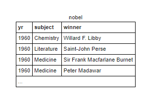
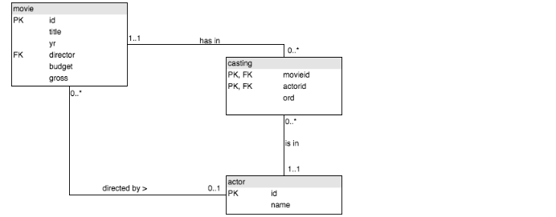

# SQL DQL - CONSULTAS
# Indice
- [Tabla world](#tabla-world)
  - [SELECTs](#selects)
  	- [Primeras Consultas](#primeras-consultas)
 	- [Condiciones con WHERE](#condiciones-con-where)
		- [AND](#and)
		- [OR](#or)
		- [XOR](#xor)
		- [BETWEEN](#between)
	- [Combinacion de Condiciones](#combinacion-de-condiciones)
	- [Operaciones en SELECT](#operaciones-en-select)
	- [AS](#as)
	- [IN](#in)
	- [LIKE](#like)
	- [DISTINCT](#distinct)
	- [AGREGADOS](#agregados)
		- [SUM](#sum)
		- [COUNT](#count)
		- [MAX](#max)
		- [AVG](#avg)
		- [MIN](#min)
	- [CONCAT](#concat)
	- [REPLACE](#replace)
	- [ROUND](#round)
	- [LENGTH](#length)
	- [LEFT](#left)
	- [NOT](#not)
  - [SELECTS Anidados y subconsultas](#selects-anidados-y-subconsultas)
- [Ejercicios de repaso](#ejercicios-de-repaso)
	- [Tabla nobel](#tabla-nobel)
- [JOINs](#join)
	- [ON](#on)
	- [BD Eurocopa](#bd-eurocopa)
 		- [Ejercicios BD Eurocopa con JOIN](#ejercicios-bd-eurocopa-con-join)
 	- [BD Pelis](#bd-pelis)
 		- [Ejercicios BD Pelis con JOIN](#ejercicios-bd-pelis-con-join)
	- [BD Profes](#bd-profes)
		- [INNER JOIN](#inner-join)
		- [LEFT JOIN](#left-join)
		- [RIGHT JOIN](#right-join)
		- [Sentido de los JOINs](#sentido-de-los-joins)
		- [COALESCE](#coalesce)
		- [Ejercicios BD Profes con NULL](#ejercicios-bd-profes-con-null)
 - [GOTCHAs](#gotchas)
----------------------------

# Tabla world
Para empezar trabajaremos con una tabla de paises llamada "world":


Sería bueno familiarizarse con la estructura de la misma o al menos tener un esquema en todo momento, para tener menos problemas a la hora de hacer los ejercicios.

[Volver al Indice](#Indice)

## SELECTs
Evidentemente, además de almacenar la información relevante, las bases de datos nos permiten recuperar la información con el fin de consultarla y/o tratarla para los fines que creamos convenientes. Es SELECT la sentencia que nos permite recuperar dicha info, seguido de los campos que queremos que se muestren y la base de datos a la que queremos acceder.

> SELECT campo1, campo2.... FROM Base_Datos;

Cabe destacar que, si bien en SQL Zoo no hace falta, las sentencias SQL deben acabar SIEMPRE con punto y coma ';'.

[Volver al Indice](#Indice)

### Primeras Consultas
Vamos a empezar a trabajar con la tabla World. Una primera consulta facilita sería obtener todos los paises de la base de datos:
```SQL
SELECT name FROM world;
```
Con el asterisco '*', podemos obtener todos los campos de una tabla:

```SQL
SELECT * FROM world;
```
Aun en base de datos mas avanzadas y con múltiples tablas, puede ser siempre útil echar mano de consultas de este estilo para conocer bien como están compuestas las bases de datos y los tipos de datos de cada columna de las tablas.

Probemos ahora con múltiples campos. Nombre y población de los paises:
```SQL
SELECT name, population FROM world;
```
[Volver al Indice](#Indice)

### Condiciones con WHERE
Al recuperar información de una base de datos o una tabla, rara vez nos interesará recuperar todas las tuplas que formen parte de ella. Es aquí donde entra la cláusula WHERE, la cual permite filtrar el contenido de una consulta, obteniendo solo los que cumplen ciertos valores. 

> SELECT campos FROM tabla WHERE predicado;

El predicado devuelve true o false dependiendo de si cada tupla cumple o no con los requisitos especificados. Aquellas que devuelven true se incluyen en el resultado de la consulta, el resto no.

Obtener población de Alemania:
```SQL
	SELECT population FROM world
  	WHERE name = 'Germany';
```

Paises con población superior a 20 Millones:

```SQL
	SELECT name FROM world
	WHERE population>=200000000;
```
Podemos agrupar condiciones con las cláusulas AND, OR o XOR:

[Volver al Indice](#Indice)

#### AND 
Nos permite obtener filas que cumplen dos condiciones. Si no cumple una, al carrer. Paises con una area superior a 3 Millones y una población de mas de 250 millones de personas:

```SQL
SELECT name, population, area
FROM world
WHERE area > 3000000 AND population > 250000000;
```
[Volver al Indice](#Indice)

#### OR
Nos permite obtener las filas que cumplen una condicion, la otra o las dos.

```SQL
SELECT name, population, area
FROM world
WHERE area > 3000000 OR population > 250000000;
```

[Volver al Indice](#Indice)

#### XOR
Nos permite obtener las filas que cumplen una condicion, la otra, pero no las dos.

```SQL
SELECT name, population, area
FROM world
WHERE area > 3000000 XOR population > 250000000;
```
Seria el equivalente a la siguiente consulta:

```SQL
SELECT name, population, area
FROM world
WHERE (area > 3000000 OR population > 250000000) AND NOT ( area > 3000000 AND population > 250000000);
```
[Volver al Indice](#Indice)

#### Combinacion de Condiciones
Evidentemente se pueden combinar un conjunto de ANDs y ORs para obtener el resultado deseado. 

Paises con un area de 6000000o con una población de 250 millones y un area de 3 millones minimo:

```SQL
SELECT name, population, area
FROM world
WHERE area > 6000000 OR (population > 250000000 AND area > 3000000);
```

En el ejemplo se obtienen los ganadores del nobel de quimica en 1984 o los que ganaron el de física en 1980
```SQL
SELECT yr, subject, winner
FROM nobel
WHERE (subject = 'Physics' AND yr=1980) OR (subject = 'Chemistry' AND yr=1984);
```
[Volver al Indice](#Indice)

### BETWEEN
Nos permite obtener las tuplas cuyo campo esté dentro de un rango de valores especificado, incluyendo los valores limite como válidos.

>BETWEEN valor1 AND valor2;

Nombre y Area de paises con un area entre 200.000 y 250.000:

```SQL
	SELECT name, area FROM world
  	WHERE area BETWEEN 200000 AND 250000;
```

Podríamos obtener un equivalente utilizando >=, <= y AND:

```SQL
	SELECT name, area FROM world
  	WHERE area>=200000 AND area<=250000;
```
[Volver al Indice](#Indice)

### Operaciones en SELECT
Se pueden realizar operaciones en el propio select (Recomendable usar Alias para que quede claro que hace).

PIB por persona:

```SQL
Select name, gdp/population as 'GDP Per Capita'
		  FROM world
	          WHERE population >= 200000000;
```

Continente Sudamerica, con población en Millones:

```SQL
SELECT name, population/1000000 as "Millones de Personas"
	FROM world
	WHERE continent = 'South America';
```
[Volver al Indice](#Indice)

### AS
Sirve para poner alias en los campos, de manera que sea mas facil identificar el tipo de info que contienen.
```SQL
	SELECT name, continent as 'Continente', population FROM world;
```

De esta manera, la tabla resultante contendrá una columna llamada "Continente". Es especialmente útil a la hora de usar funciones de agregado o campos calculados, donde el nombre generado automáticamente por el motor SQL puede ser algo menos representativo.

Así mismo, AS puede ser utilizado para renombrar tablas, y trabajar directamente con dicho alias. Sin embargo, me parece una tonteria detallar esto aquí, ya que aún falta un trecho para trabajar con esta variante. Lo vemos mas adelante  (Apartado de JOINs especialmente).

[Volver al Indice](#Indice)


### IN
Permite filtrar filas cuyo campo esté en uno de los valores contenidos dentro de la clausula. Similar al operador '=', con la particularidad de que sirve para comparar contra múltiples valores o resultados sin utilizar clausulas de condición.

Paises cuyo nombre está dentro de los valores Alemania, Francia e Italia:

```SQL
SELECT name, population
FROM world
WHERE name IN ('France', 'Germany', 'Italy');
```

Utilizando la cláusula OR en combinación con el operador '=' podríamos llegar a la misma jugada:

```SQL
SELECT name, population
FROM world
WHERE name = 'France' OR name = 'Germany' OR name = 'Italy';
```

Si bien en este caso no es que sea mucho lío, mas adelante se verán casos donde no es nada práctica esta variante, especialmente cuando dentro del IN hay una subconsulta.

IN devuelve 1 (Si se cumple) y 0(Si no se cumple), se puede usar para ordenar campos (Ultimos los que lo cumplan por ejemplo):
```SQL
SELECT winner, subject
  FROM nobel
 WHERE yr=1984
 ORDER BY subject IN ('Physics','Chemistry') ASC, subject, winner;
```

[Volver al Indice](#Indice)

### LIKE
Nos permite filtrar por campos que cumplen un patron determinado. Utilizado para tipo String, normalmente viene seguido de expresiones regulares (A diferencia del signo =, que solo realiza comparaciones con cadenas fijas).

[Volver al Indice](#Indice)

#### Caracteres de filtrado de LIKE
*_* - Caracter único (Si necesitamos 4, pues 4 guiones bajos)

*%* - Cualquier cosa, da igual el num de caracteres y el tipo. De 0 a n caracteres. Cuidado con el 0!.

Por ejemplo, en este caso, nombres de paises que contengan United en el nombre, sin importar donde:
```SQL
SELECT name
FROM world
WHERE name LIKE '%United%';
```

Los paises que tienen todas las vocales, sin espacios:
```SQL
SELECT name
   FROM world
WHERE name LIKE '%a%' AND name LIKE '%e%' AND name LIKE '%i%' AND name LIKE '%o%' AND name LIKE '%u%'
  AND name NOT LIKE '% %';
```

[Volver al Indice](#Indice)

### DISTINCT
Devuelve los resultados sin repetidos en un campo concreto (Ejecuta algo similar a un GROUP BY por debajo)

> Estructura SELECT DISTINCT campo FROM tabla;

Ejemplo: Supongamos que tenemos la siguiente salida en una consulta:

| Columna |
|---------|
| uno     |
| uno     |
| dos     |
| tres    |
| dos     |

Muchas veces no nos interesará tener los valores repetidos (Por ejemplo mostrar los continentes de una tabla de paises, no queremos mostrar el continentes 30 veces). Para estos casos usamos DISTINCT, obteniendo un resultado como este:

| Columna |
|---------|
| uno     |
| dos     |
| tres    |

Muestra los continentes que hay en la tabla world, sin repetidos:

```SQL
SELECT DISTINCT continent FROM world;
```

[Volver al Indice](#Indice)

### AGREGADOS
Las funciones reductoras nos permiten obtener un valor en base a una operación que se va a realizar utilizando multiples tuplas, dando solo una tupla como resultante. Podemos Sumar, contar, coger el valor máximo, el mínimo, la media... Son especialmente útiles en combinación con las funciones de agrupado.

> Al devolver solo una tupla, debemos ser cautelosos y no combinarlo con campos que devuelvan mas de uno, ya que da error (SQL no puede trabajar con distinto numero de resultados en la misma consulta).

[Volver al Indice](#Indice)

#### SUM
Función que devuelve la suma de todas del tuplas del campo especifico que le pasamos.

> Estructura SUM(campo)

Suma de habitantes en Asia:
```SQL
SELECT sum(population) AS 'Habitantes de asia'
FROM world
WHERE continent = 'Asia';
```

Suma de habitantes entre Estonia, Letonia y Lituania:

```SQL
SELECT SUM(population)
FROM world
WHERE name IN ('Estonia', 'Latvia', 'Lithuania');
```

[Volver al Indice](#Indice)

#### COUNT
Función que cuenta el numero de tuplas resultantes de una consulta. Si la consulta devuelve 3 filas, el resultado será 3:

> Estructura COUNT(campo)

Cuantos paises tienen mas de 1 millon de area:

```SQL
SELECT count(name)
FROM world
WHERE area>1000000;
```

[Volver al Indice](#Indice)

#### MAX
Función que devuelve el mínimo de un conjunto de resultados.

> Estructura MAX(campo)

Pais con mayor población:
```SQL
SELECT MAX(population)
FROM world;
```

[Volver al Indice](#Indice)

#### AVG
Calcula el promedio de un conjunto de resultado.

> Estructura AVG(campo)

Población media:
```SQL
SELECT AVG(population)
FROM world;
```

[Volver al Indice](#Indice)

#### MIN
Función que devuelve el maximo de un conjunto de resultados

> Estructura MIN(campo)

Pais con menor población:

```SQL
SELECT MIN(population)
FROM world;
```
[Volver al Indice](#Indice)

### CONCAT
Concatena valores. No hay mucho mas que decir.

>CONCAT(campo, 'Valor a Concatenar')

Ejemplo que muestra capital y nombre de aquellos paises cuya capital es el nombre mas algo mas:
```SQL
	Select capital, name
	FROM world
	WHERE capital LIKE CONCAT(name,'_%');
```
[Volver al Indice](#Indice)

### REPLACE
Reemplaza caracteres por otro indicado.

>Replace (Campo, 'Caracter_a_Remplazar', 'Caracter_Sustituyente') 

En la capital sustituye el nombre del pais por cadena vacia (De manera que solo nos queda la extension).

```SQL
	Select name, REPLACE (Capital, name, '') AS Extension
	FROM world
	WHERE capital LIKE CONCAT(name,'_%');
```

| name      | Extension |
|-----------|-----------|
| Andorra   | la Vella  |
| Guatemala | City      |
| Kuwait    | City      |
| Mexico    | City      |
| Monaco    | -Ville    |
| Panama    | City      |

[Volver al Indice](#Indice)

### ROUND
Nos permite redondear un numero a X decimales. La estructura vendría a ser algo como Round(Valor, precisión), donde precisión puede referirse a decimales o a unidades, decenas, centenas....

Redondeo con dos decimales:
```SQL
SELECT name, ROUND(population/1000000, 2) as 'Poblacion Millones', ROUND(gdp/1000000000,2) as 'Billones PB'
FROM world
WHERE continent = 'South America';
```

Redondeo a millares (Podemos ver que se usa un valor negativo... La vida es dura):

 ```SQL
 SELECT name, ROUND(gdp/population, -3) as 'PIB per Capita'
FROM world
WHERE gdp>1000000000000;
```

[Volver al Indice](#Indice)

### LENGTH
Nos permite obtener la longitud de un campo o valor. 

>Estructura LENGTH(campo)

En el siguiente ejercicio imprimimos nombre y capital con la misma longitud de caracteres:

```SQL
SELECT name, capital
  FROM world
 WHERE LENGTH(name) = LENGTH(capital);
```

[Volver al Indice](#Indice)

### LEFT
Permite extraer x caracteres de un String. 

>Estructura LEFT(valor, caracter)

En el siguiente ejercicio, se cogen los países cuyo nombre y nombre de capital empiezan por la misma letra, siendo sus nombres distintos (<> Operador de desigualdad)

```SQL
SELECT name, capital
FROM world
WHERE LEFT(name,1) = LEFT(capital,1) AND name<>capital;
```

[Volver al Indice](#Indice)

### NOT
Básicamente ignora aquellas filas que cumplan la condicion que la sigue, solo le valen aquellas que no lo cumple. Por ejemplo, aquellos premios que no sean de quimica y medicina:

```SQL
SELECT yr, subject, winner
FROM nobel
WHERE yr = 1980 AND subject NOT IN ('Chemistry', 'Medicine');
```

Actua de la misma manera que el operador de negación de Java (!);

[Volver al Indice](#Indice)

## SELECTS Anidados y subconsultas
Nos permiten filtrar una consulta usando resultados de otras consultas internas. Se utilizan en el predicado cuando queremos comparar las tuplas del FROM contra los resultados de otra consulta.

```SQL
SELECT name 
FROM world
WHERE continent = 'europe' AND gdp/population >(        
         SELECT gdp/population 
         FROM world 
         WHERE name = 'United Kingdom');
```

[Volver al Indice](#Indice)

### Combinado con IN, AND, CONCAT....
Si el select interno devuelve mas de una fila, podemos usar in para comprobar que está dentro
```SQL
SELECT name, continent
FROM world
WHERE continent in (
	SELECT continent FROM world 
	WHERE name = 'Argentina' 
	OR name ='Australia')
ORDER BY name;
```
Podemos utilizar ANDs y utilizar otro select anidado adicional.
```SQL
SELECT name, population FROM world
WHERE population > (
	SELECT population 
	FROM world 
	WHERE name='Canada') 
AND population < (
		SELECT population 
		FROM world 
		WHERE name='Poland');
```

Alternativa con BETWEEN (Notese que debemos omitir los valores de canada y polonia):
```SQL
SELECT name, population
FROM world
WHERE population BETWEEN (
	SELECT population 
	FROM world 
	WHERE name='Canada') 
	AND (
	SELECT population 
	FROM world 
	WHERE name = 'Poland') 
	AND name NOT IN ('Canada','Poland');
```

Podemos usar un select en el propio select (Combinado con concat y redondeo):

```SQL
SELECT name, CONCAT (
	ROUND (population/(
		SELECT population 
		FROM world 
		WHERE name='Germany') 
	*100)
	,'%')
FROM world
WHERE continent = 'Europe';
```

[Volver al Indice](#Indice)

## ALL
Es una clasula que comprueba si una condición se cumple en todas las filas. (En este caso, busca el nombre del pais cuyo gdp es mayor a todos los de Europa).

Es importante la clausula is not null, ya que a veces petardea.
```SQL
SELECT name
FROM world
WHERE gdp > ALL(
	SELECT gdp FROM world WHERE continent = 	
	'Europe' AND gdp IS NOT NULL) ;
```

[Volver al Indice](#Indice)

## Alias para las Tablas
Podemos comparar las tablas de dos selects usando alias para cada consulta
```SQL
SELECT continent, name
FROM world x
WHERE name <= ALL(
	SELECT name FROM world y 
	WHERE x.continent=y.continent);
```
Si no usaramos alias, comparariamos el continente con el de la misma consulta , y la consulta haría cualquier cosa...

```SQL
SELECT continent, name, area FROM world x
  WHERE area>= ALL
    (SELECT area FROM world y
        WHERE y.continent=x.continent
          AND area IS NOT NULL);
```

```SQL
SELECT continent, name
FROM world x
WHERE name <= ALL(SELECT name FROM world y 
WHERE x.continent=y.continent);
```
Esto sería lo mismo que la anterior:
```SQL
SELECT continent, name
FROM world x
WHERE name < ALL(SELECT name FROM world y 
WHERE x.continent=y.continent
AND x.name <> y.name);
```
En la primera ponemos >= que nombre para incluir que el pais alfabéticamente menor también cumpla la función. Una manera de hacer lo mismo solo con >, es excluyendo al pais de mismo nombre en la propia consulta interna.

Tenemos que sacar los paises de los continentes donde todos los países tienen menos de 25000000: 

```SQL
SELECT name, continent, population
FROM world x
WHERE 25000000 >= ALL(SELECT population 
from world y WHERE x.continent=y.continent)
```
Podemos simplemente usar la poblacion maxima de cada continente:
```SQL
SELECT name,continent, population
FROM world as w1
WHERE 25000000 >= (
	SELECT max(population) 
	FROM world as w2 
	WHERE w1.continent=w2.continent );
```
Ahora probamos con dos subconsultas. 

```SQL
SELECT name, continent, population
FROM world WHERE continent IN
	(SELECT continent
	FROM world x
	WHERE 25000000 >= ALL(SELECT population 
	from world y WHERE 	
	x.continent=y.continent)) ;
```

Alternativa con Group BY:
```SQL
SELECT name,continent, population
FROM world
	WHERE continent IN(
		SELECT continent 
		FROM world 
		GROUP BY continent 
		HAVING max(population)<=25000000);
```
La subconsulta mas interna obtiene todos los países del continente a comparar, la posterior filtra solo los continentes donde se cumple la condición, y la tercera muestra todos los países de esos continentes.

Podemos realizar operaciones en los SELECT anidados y condiciones adicionales excluyentes.

```SQL
SELECT name, continent
FROM world x
WHERE population > ALL(
SELECT (population*3) FROM world y
WHERE x.continent=y.continent AND y.name<>x.name);
```

[Volver al Indice](#Indice)

## GROUP BY
Nos permite agrupar los resultados por un campo concreto. De esta manera se generan subtablas para cada valor del campo agrupado.

Numero de paises por cada continente:
```SQL
SELECT continent, count(name)
FROM world
GROUP BY continent;
```

Numero de paises mayores de 10.000.000 de población en cada continente:
```SQL
SELECT continent, count(name)
FROM world
WHERE population>=10000000
GROUP BY continent;
```
Nombre de cada continente que tiene mas de 10.000.000 de habitantes en total:
```SQL
SELECT continent
FROM world x
WHERE 100000000<=(SELECT SUM(population) FROM world y 
WHERE y.continent=x.continent)
GROUP BY continent;
```

[Volver al Indice](#Indice)

## HAVING
Nos sirve como filtro para el agrupado Group By. Normalmente actua sobre funciones reductoras, tales como COUNT, SUM..., o sobre los mismos campos agrupados.

Continentes que tienen una poblacion total de al menos 100 Millones. En este caso usamos el having para filtrar los continentes 
sobre los que agrupamos.
```SQL
SELECT continent
FROM world 
GROUP BY continent
HAVING SUM(population)>=100000000;
```

[Volver al Indice](#Indice)

# Ejercicios de repaso
## Tabla nobel
Cambiamos la tabla activa por una sobre premios nobel con la siguiente estructura: 



[Volver al Indice](#Indice)

## Ejercicios

Premios Nobel de 1950:

```SQL
SELECT yr, subject, winner
  FROM nobel
 WHERE yr = 1950;
```

Ganador del Nobel de Literatura en 1962:

```SQL
SELECT winner
  FROM nobel
 WHERE yr = 1962
   AND subject = 'Literature';
```

Año y tema del Nobel de Einstein:
```SQL
SELECT yr, subject
FROM nobel
WHERE winner = 'Albert Einstein';
```

Ganadores del Nobel de la Paz desde el 2000 en adelante:
```SQL
SELECT winner
FROM nobel
WHERE yr>=2000 AND subject='Peace';
```

Toda la información de los premios Nobel de Literatura entre 1980 y 1989, estos años incluidos:
```SQL
SELECT *
FROM nobel
WHERE subject = 'Literature' AND yr BETWEEN 1980 AND 1989;
```

Toda la información de los premios Nobel presidenciales (Roosevelt, Wilson, Carter y Obama):
```SQL
SELECT * FROM nobel
 WHERE winner IN ('Theodore Roosevelt','Woodrow Wilson','Jimmy Carter','Barack Obama');
```

Ganadores con nombre John:
```SQL
SELECT winner
FROM nobel
WHERE winner LIKE 'John%';
```

Año, tema y ganador del Nobel de Física en 1980 o de Química en 1984:
```SQL
SELECT yr, subject, winner
FROM nobel
WHERE (subject = 'Physics' AND yr=1980) OR (subject = 'Chemistry' AND yr=1984);
```

Año, tema y ganador de Nobel de 1980, excluyendo Medicina y Química:
```SQL
SELECT yr, subject, winner
FROM nobel
WHERE yr = 1980 AND subject NOT IN ('Chemistry', 'Medicine');
```

Año, tema y ganador del Nobel de mediciona antes de 1910 o de literatura de 2004 en adelante:
```SQL
SELECT yr, subject, winner
FROM nobel
WHERE (subject = 'Medicine' AND yr<1910) OR (subject = 'Literature' AND yr>=2004);
```

Toda la informacion de PETER GRÜNBERG:
```SQL
SELECT *
FROM nobel
WHERE winner like 'Peter Grünberg';
```

Toda la informacion de EUGENE O'NEILL (Para la comilla simple hay que poner dos comillas simples consecutivas):
```SQL
SELECT *
FROM nobel
WHERE winner like 'Eugene O''Neill';
```

Mostrar ganador, año y categoría, cuando el ganador tenga el título de Sir, ordenado de mas reciente a mas antiguo:
```SQL
SELECT winner, yr, subject
FROM nobel
WHERE winner LIKE 'Sir%'
ORDER BY yr DESC;
```

Ganador y categoría del año 1984, estando los de Física y Química al final:
```SQL
SELECT winner, subject
  FROM nobel
 WHERE yr=1984
 ORDER BY subject IN ('Physics','Chemistry') ASC, subject, winner;
```

[Volver al Indice](#Indice)

# JOIN
Hasta ahora estuvimos trabajando con una sola tabla. Para trabajar con multiples tablas necesitamos JOINs que viene a unir dos o mas tablas en una resultante para que operemos con ella, con la suma de las columnas de ambas (Si una tabla tiene 3 columnas y la otra dos, la tabla unida resultante tendrá 5 columnas). 

Antes de empezar, hay que destacar que al hacer JOIN se produce un producto cartesiano, conformando todas las combinaciones posibles entre las tuplas de una tabla y otra. Para acotar este resultado, debemos usar la cláusula ON, que nos permite especificar en que campo coincidente se produce la union entre tablas, y a partir de ahi trabajar con WHEREs o HAVINGs para filtrar el resultado.

[Volver al Indice](#Indice)

## ON 
Nos permite especificar en que campo se produce la unión entre dos tablas que DEBEN ESTAR RELACIONADAS.

>Estructura SELECT * FROM Tabla1 JOIN tabla2 ON clavePrincipal=claveAjena; 

[Volver al Indice](#Indice)

## BD Eurocopa
Tenemos la siguiente base de datos. Necesitamos saber las claves y las claves ajenas a las que referencian, para poder usar los joins:


[Volver al Indice](#Indice)

### Ejercicios BD Eurocopa con JOIN
Ejemplo. Supongamos que queremos los goles de un equipo. Tendriamos algo como esto.
```SQL
SELECT matchid, player
FROM goal
WHERE teamid='GER';
```

Sin embargo, si en vez de usar la id del equipo queremos filtrar por el nombre, necesitamos un JOIN con la tabla eteam:

```SQL
SELECT matchid, player
FROM goal
JOIN eteam on teamid=id
WHERE teamname='Germany';
```

Ahora supongamos que queremos mostrar todos los goles de alemania en el torneo, mostrando la fecha del partido. Para ello necesitamos unir tablas, de manera que acotando datos podamos mostrar detalles de la tabla gol y la tabla partido.

```SQL
SELECT player, teamid, stadium, mdate
  FROM game JOIN goal ON (id=matchid)
WHERE teamid='GER';
```

Mostrar equipos y jugador para cada gol marcado por alguien llamado mario.
```SQL
SELECT team1, team2, player
  FROM game JOIN goal ON (id=matchid)
WHERE player LIKE 'Mario%';
```

Goles marcados los primeros 10 minutos, mostrando jugador, equipo, entrenador y tiempo:
```SQL
SELECT player, teamid, coach, gtime
  FROM goal JOIN eteam on teamid=id
 WHERE gtime<=10;
```

> Podemos referenciar tanto atribrutos como las claves de join especificando la tabla a la que pertenecen, usando la estructura  (tabla.campo)

Lista de partidos y nombre de equipo entrenado por fernando santos. Cabe destacar que ambas tablas del join cuentan con un campo ID, con lo cual debemos indicar la tabla a la que estamos referenciando (tabla.campo):

```SQL
SELECT mdate, teamname
FROM game JOIN eteam ON (team1=eteam.id)
WHERE coach='Fernando Santos';
```

Jugadores que han marcado en el estadio de varsovia:
```SQL
SELECT player 
FROM goal JOIN game on matchid=id
WHERE stadium='National Stadium, Warsaw';
```

Mostrar nombre de los jugadores que marcaron a alemania:
```SQL
SELECT DISTINCT(player)
  FROM game JOIN goal ON matchid = id 
    WHERE (team1='GER' OR team2='GER') AND teamid<>'GER';
```

Mostrar equipo y goles metidos por cada uno. Necesitamos agrupar:
```SQL
SELECT teamname, count(*)
FROM eteam JOIN goal ON id=teamid
GROUP BY teamname
ORDER BY teamname;
```

Numero de goles marcados en cada estadio:
```SQL
SELECT stadium, count(*) AS 'Goles'
FROM goal JOIN game on matchid=id
GROUP BY stadium;
```

Goles marcados en cada partido donde polonia jugo, mostrando id de partido y fecha:
```SQL
SELECT matchid, mdate, COUNT(*) AS 'Goles'
  FROM game JOIN goal ON matchid = id 
 WHERE (team1 = 'POL' OR team2 = 'POL')
GROUP BY matchid, mdate;
```

En cada partido con goles de Alemania, mostrar id de partido, fecha y numero de goles alemanes:
```SQL
SELECT matchid, mdate, count(*)
FROM goal JOIN game on matchid=id
WHERE teamid='GER'
GROUP BY matchid, mdate;
```

[Volver al Indice](#Indice)

## BD Pelis
Volvemos a cambiar de base de datos para seguir trabajando con JOINS. La base de datos es sobre peliculas y castings.



[Volver al Indice](#Indice)

### Ejercicios BD Pelis con JOIN

Peliculas de 1962:
```SQL
SELECT id, title
 FROM movie
 WHERE yr=1962;
```

Año en el que se hace Ciudadano Kane:
```SQL
select movie.yr
from movie
where title='Citizen Kane';
```

Mostrar todas las pelis de Star Trek:
```SQL
SELECT movie.id, movie.title, movie.yr
FROM movie
WHERE title LIKE 'Star Trek%'
ORDER BY yr;
```

Mostrar el id del actor Glenn Close:
```SQL
SELECT actor.id 
FROM actor
WHERE name = 'Glenn Close';
```

Id de la pelicula Casablanca:
```SQL
SELECT movie.id
FROM movie
WHERE title='Casablanca';
```

Actores de la pelicula casablanca, y otra para actores de Alien:
```SQL
SELECT actor.name
FROM casting JOIN actor ON casting.actorid=actor.id
JOIN movie ON casting.movieid=movie.id
WHERE movie.title='Casablanca';
```
Alternativa con subconsulta:
```SQL
SELECT actor.name
FROM casting JOIN actor ON casting.actorid=actor.id
WHERE casting.movieid=(
             SELECT movie.id 
             FROM movie 
             WHERE movie.title='Casablanca');
```

```SQL
SELECT actor.name
FROM casting JOIN actor ON casting.actorid=actor.id
JOIN movie ON casting.movieid=movie.id
WHERE movie.title='Alien';
```

Alternativa cambiando el predicado de ON a WHERE para SQL Server:
```SQL
SELECT actor.name
FROM casting, actor, movie
WHERE movie.title='Alien' 
      AND casting.actorid=actor.id 
      AND casting.movieid=movie.id;
```

Alternativa cambiando el predicado de ON a WHERE para MySQL:
```SQL
SELECT actor.name
FROM casting JOIN actor JOIN movie
WHERE movie.title='Alien' 
      AND casting.actorid=actor.id 
      AND casting.movieid=movie.id;

```

Peliculas donde aparece Harrison Ford:

```SQL
SELECT movie.title 
FROM casting JOIN actor on casting.actorid=actor.id
JOIN movie on casting.movieid=movie.id
WHERE actor.name='Harrison Ford';
```

Peliculas donde Harrison Ford es actor de reparto (ord es 1 cuando es prota):
```SQL
SELECT movie.title 
FROM casting JOIN actor on casting.actorid=actor.id
JOIN movie on casting.movieid=movie.id
WHERE actor.name='Harrison Ford' AND casting.ord<>1;
```

Años en los que Rock Hundson hizo mas de dos pelis:
```SQL
SELECT yr,COUNT(title) FROM
  movie JOIN casting ON movie.id=movieid
        JOIN actor   ON actorid=actor.id
WHERE name='Rock Hudson'
GROUP BY yr
HAVING COUNT(title) > 2;
```

Actor principal y nombre de las pelis donde participa Julie Andrews:
```SQL
SELECT movie.title, actor.name FROM casting
JOIN movie on movie.id=casting.movieid 
JOIN actor on actor.id=casting.actorid 
WHERE movie.id IN (
  SELECT movieid 
  FROM casting 
  WHERE actorid IN 
              (SELECT id 
               FROM actor 
               WHERE name = 'Julie Andrews' )) 
  AND ord=1;
```

Actores con 30 protagonismos:
```SQL
SELECT actor.name
FROM actor 
JOIN casting ON casting.actorid=actor.id 
WHERE casting.ord=1
GROUP BY actor.name
HAVING count(casting.movieid)>=30
ORDER BY actor.name ASC;
```

Peliculas de 1978 ordenadas por numero de actores:
```SQL
SELECT movie.title, count(casting.actorid) AS "Actores"
FROM movie
JOIN casting on movie.id=casting.movieid
WHERE yr=1978
GROUP BY movie.title
ORDER BY count(casting.actorid) DESC, movie.title;
```

Actores que han trabajado con Art Garfunkel:
```SQL
SELECT DISTINCT actor.name
FROM actor
JOIN casting x ON actor.id=x.actorid
WHERE actor.name<>'Art Garfunkel' 
      AND 'Art Garfunkel' IN(
                             SELECT name 
                             FROM actor 
                             JOIN casting y 
                             ON actor.id=y.actorid 
                             WHERE x.movieid=y.movieid);
```

Alternativa con JOINs:

```SQL
SELECT DISTINCT a1.name
FROM actor AS a1 
          JOIN casting AS c1 ON a1.id=c1.actorid
          JOIN casting AS c2 ON c1.movieid=c2.movieid 
          JOIN actor AS a2 ON a2.id=c2.actorid
WHERE a2.name='Art Garfunkel' AND a1.id<>a2.id;
```

[Volver al Indice](#Indice)

## BD Profes
Cambiamos a otra base de datos, de profesores y departamentos donde la relación puede no existir (0:N).


[Volver al Indice](#Indice)

### INNER JOIN
Este tipo de JOIN ignora los nulos de ambos lados, y solo incluye tuplas donde haya valores de los dos lados.

```SQL
SELECT teacher.name, dept.name
FROM teacher INNER JOIN dept
           ON (teacher.dept=dept.id);
```

Resultado:

| Name      | Name      |
|-----------|-----------|
| Shrivell  | Computing |
| Throd     | Computing |
| Splint    | Computing |
| Cutflower | Design    |

[Volver al Indice](#Indice)

### LEFT JOIN
Solo ignora los nulos del lado derecho, incluyendo todas las tuplas donde el izquierdo tiene un valor no nulo:
```SQL
SELECT teacher.name, dept.name
FROM teacher LEFT JOIN dept
           ON (teacher.dept=dept.id);
```
Resultado:

| Name       | Name      |
|------------|-----------|
| Shrivell   | Computing |
| Throd      | Computing |
| Splint     | Computing |
| Spiregrain |           |
| Cutflower  | Design    |
| Deadyawn   | Design    |

[Volver al Indice](#Indice)

### RIGHT JOIN
Solo ignora los nulos del lado izquierdo, incluyendo todas las tuplas donde el derecho tiene un valor no nulo:
```SQL
SELECT teacher.name, dept.name
FROM teacher RIGHT JOIN dept
           ON (teacher.dept=dept.id);
	  
```
Resultado:

| Name      | Name        |
|-----------|-------------|
| Shrivell  | Computing   |
| Throd     | Computing   |
| Splint    | Computing   |
| Cutflower | Design      |
|           | Engineering |

[Volver al Indice](#Indice)

### Sentido de los JOINs
En el Inner Join, salvo en casos muy especificos, en orden de las tablas no afecta a la operación. Sin embargo, tanto LEFT JOIN como RIGHT JOIN dependen del orden en el que presentamos la tabla. Por ejemplo, la consulta de antes:

```SQL
SELECT teacher.name, dept.name
FROM teacher LEFT JOIN dept
           ON (teacher.dept=dept.id);
```

Podría obtenerse lo mismo usando un RIGHT JOIN cambiando el orden de las tablas:
```SQL
SELECT teacher.name, dept.name
FROM dept RIGHT JOIN teacher
           ON (teacher.dept=dept.id);
```

> Lo que si podemos intercambiar es el orden de los atributos en la igualdad, ya que no es relevante.

[Volver al Indice](#Indice)

### COALESCE
Nos permite sustituir NULL por un valor que nos permita tratar el campo, como por ejemplo en concatenaciones o funciones de suma.

> Estructura COALESCE(campo, valor_para_NULL);

Por ejemplo, sustituimos el movil del usuario por el telefono del centro, cuando este no lo tenga. Para el resto muestra su propio teléfono:

```SQL
SELECT name, COALESCE(mobile, '07986 444 2266')
FROM teacher;
```

[Volver al Indice](#Indice)

### CASE WHEN
Nos permite especificar imprimir en la tabla distintos resultados segun la condicional que cumpla el campo que comprobamos. Similar al Case de JAVA:

 > Estructura 
 > CASE campo
 >     WHEN valor1 THEN 'valor reprensetado'
 >     WHEN valor2 THEN 'valor reprensetado'
 >     ELSE 'Valor para el resto'
 > END

Profesores y departamento, poniendo Sci para dep 1 y 2, y Art para el resto:

```SQL
SELECT name,  
CASE dept
     WHEN 1 THEN 'Sci'
     WHEN 2 THEN 'Sci'
     ELse 'Art'
END 
AS 'type'
FROM teacher;
```

[Volver al Indice](#Indice)

### Ejercicios BD Profes con NULL

Lista de profesores con departamento nulo:

```SQL
SELECT teacher.name
FROM teacher
WHERE teacher.dept IS NULL;
```

Nombre de todos los profesores y departamento (Aunque no lo tengan), sustituyendo nulos por 'None':
```SQL
SELECT teacher.name, COALESCE(dept.name, 'None') AS 'Dept'
FROM teacher 
LEFT JOIN dept ON teacher.dept=dept.id;
```

Contar profesores y moviles (Comprobación de que los agregados ignoran NULL):
```SQL
SELECT 
          count(*) AS 'Num Profes', 
          count(mobile) AS 'Num Moviles'
FROM teacher;
```

Contar profesores por departamento, incluyendo aquellos que departamentos que no tienen profes:
```SQL
SELECT dept.name, count(teacher.name) AS 'Numm Profes'
FROM dept LEFT JOIN teacher ON dept.id=teacher.dept
GROUP BY dept.name;
```

Profesores y departamento, poniendo Sci para dep 1 y 2, Art para el dep 3, 'None' para el resto:
```SQL
SELECT name,  
CASE dept
     WHEN 1 THEN 'Sci'
     WHEN 2 THEN 'Sci'
     WHEN 3 THEN 'Art'
     ELse 'None'
END 
AS 'type'
FROM teacher;
```

[Volver al Indice](#Indice)

# GOTCHAs
### Problemas con los caracteres especiales

 - La comilla simple se referencia como dos comillas simples

```SQL
SELECT *
FROM nobel
WHERE winner like 'Eugene O''Neill';
```
### Consultas Anidadas
 - Las subconsultas han de ir siempre a la derecha de la condición.

### Desigualdades y NOT
Las desigualdades se expresan como <>.
```SQL
WHERE a<>b -- Es lo mismo que
WHERE NOT a = b
```

### WHERE y HAVING
El WHERE se ejecuta sobre la consulta, es decir, la totalidad de las filas obtenidas. El having se aplica sobre las subtablas agrupadas posteriormente.

### LIKE y =
Like 'Star%' es una expresion regular, que busca aquellas frases que empiecen por Star
= 'Star%' es una cadena, busca las palabras Star%, donde % es un caracter normal a buscar

### Predicados
Funcion que devuelve True o False. Incluye:
	-Lo que esta despues del WHERE
	-Lo que esta despues del ON en los JOINs
	-Lo que está despues del HAVING
	-Los predicados pueden ejecutarse en el ON o en el WHERE (Usando ANDs). El HAVING suelen ejecutarse junto a funciones de agregado.
	
### El SELECT COUNT se ejecuta una vez por cada SUBTABLA

### NULL
Para buscar nulos en una tabla debe usarse siempre IS NULL o IS NOT NULL. Con el = no funciona.

### JOIN sin ON
En cualquier tipo de JOIN, si quitamos el ON, se produce un producto cartesiano con tantas tuplas como combinaciones posibles. Incluyendo el ON y utilizando PK y FK, solo mostramos aquellas tuplas donde existe relación.

### Agregados y NULL
Las funciones de agregado ignoran por completo los campos que tomas valor nulo en una tupla.

### =
No es una asignación, es una funcion equals que devuelve true o false

### JOIN
Usar JOIN a secas es lo mismo que usar INNER JOIN, ignorando los nulos de ambos lados.

### Declarativo vs Imperativo
En declarativo no sabemos que hace cada funcion, simplemente llamamos y sabemos lo que devuelve (SQL es declarativo, se centra en el que). En imperativo tenemos que detallar los pasos uno a uno (Java, se centra en el como). 

### WHERE Y ON
SQL transforma las consultas a álgebra relacional y, por tanto, no cambia la velocidad de las consultas si ponemos el predicado del ON en el WHERE o viceversa.

### Comillas para Strings
Si bien muchas SGBD permiten comillas dobles, pero mejor usar siempre comillas simples ''.

### Consulta mínima
La consulta minima debe especificar que datos queremos y de donde provienen, es decir un SELECT loquesea FROM tabla;

### ORDEN de Ejecucion
Este es precísamente el orden de ejecución.

1. Ejecutamos el FROM, obteniendo todas las tuplas
2. Ejecutamos el predicado del `WHERE` **en cada una de las tuplas**, filtrando aquellas que no lo cumplan.
3. Ejecutamos el `GROUP BY` **en cada una de las tuplas**, haciendo grupos/subtablas según el criterio especificado.
4. Ejecutamos el `HAVING` **una vez por cada grupo/subtabla**.
5. Finalmente ejecutamos el `SELECT` **una vez por cada grupo/subtabla**.

[Volver al Indice](#Indice)

### Repasar
1. XOR y variante
2. Between variante
3. LENGTH
4. LEFT
5. COALESCE

•	Para cadenas usar comillas simples
•	Acordarse de checkear punto y coma
•	Tener muchísimo cuidado con los valores nulos, a veces hay que excluirlos de la consulta para que vaya bien
•	Cuidado cuando hacemos cálculos de excluir a las filas que deberían salir (En el ejercicio de continentes por ejemplo, no tenemos que multiplicar por 3 a la misma fila que debería salir, ya que nunca se cumpliría)
•	Renombrar campos en campos calculados o funciones reductoras

--------------------------------------------
[Volver al Indice](#Indice)
