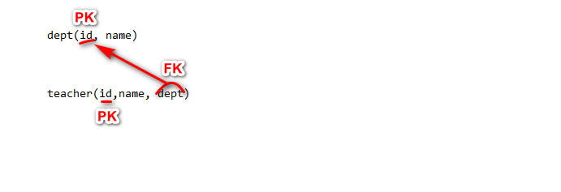
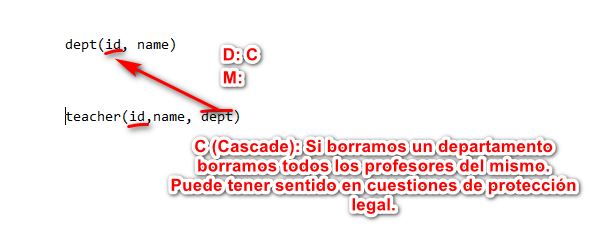
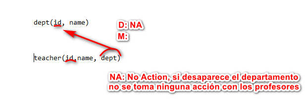
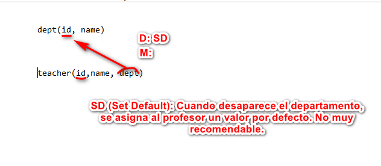
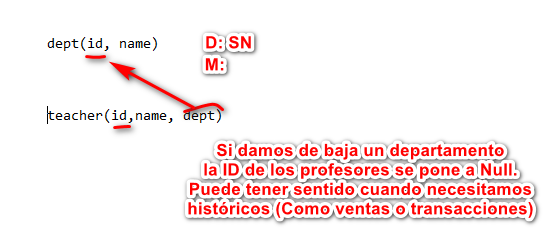

# Indice
- [Sublenguajes](#sublenguajes)
- [DDL Data Definition Language](#ddl-data-definition-language)
	- [CREATE SCHEMA DATABASE](#create-schema-o-database)
	- [CREATE TABLE](#create-table)
		- [DECLARACION DE CAMPOS](#declaracion-de-campos)
			- [CONSTRAINT PK](#constraint-pk)
			- [CONSTRAINT FK](#constraint-fk)
				- [CASCADE](#cascade)
				- [NO ACTION](#no-action)
				- [SET DEFAULT](#set-default)
				- [SET NULL](#set-null)
				- [MATCH FULL](#match-full)
				- [MATCH PARTIAL](#match-partial)
			- [CONSTRAINT UNIQUE](#constraint-unique)
			- [CONSTRAINT CHECK](#constraint-check)
			
-----------------------
# Sublenguajes
- DDL Data Definition Lenguage (Opera sobre los objetos de la BD. Tablas, fila, columna, indice...)
	- CREATE
	- ALTER
	- DROP

- DML Data Manipulation Language (Antes SELECT se incluía ahi. Opera sobre los datos)
	- UPDATE 
	- INSERT
	- DELETE
	
- DCL Data Control Language (Permisos)
	- GRANT
	- REVOKE
	
- SCL Session Control Language (Manejar dinamicamente propiedades de sesión de usuario)
	- ALTER SESSION
	- SET ROLE
	
- TCL Transaction Control Language (Unidad logica de procesado compuesta por varias transacciones)
	- Commit
	- Rollback
	- SafePoint

- DQL Data Query Language (Relativamente nuevo para englobar a SELECT, que es muy potente. Opera sobre los datos)
	- SELECT

# DDL Data Definition Language
## CREATE SCHEMA o DATABASE 
Para crear base de datos, utilizamos la siguiente sintaxis:

```sql
CREATE (SCHEMA|DATABASE) [IF NOT EXISTS] [CHARACTER SET <Nombre Charset> [COLLATE <Nombre_Variante>]] << NombreBD >>;
```

En general las bases de datos y los esquemas se comportan de la misma manera, habiendo algunas diferencias en el tratamiento de permisos.

Estructura:
```sql
CREATE DATABASE nombreBD;
```

Alternativa:
```sql
 CREATE SCHEMA nombreBD;
```

Opciones:
- IF NOT EXISTS: Opcional. Comprueba si la base de datos que vamos a crear ya existe en el SGBD.
- CHARACTER SET: Opcional. CHARACTER SET especifica el conjunto de caracteres que se va a utilizar (Ejemplo: latin1).
- COLLATE: Opcional. Se combina con CHARACTER SET. Ayuda a elegir la variante esepecífica dentro de dicho conjunto (Ejemplo: latin1_swedish_ci)

## CREATE TABLE
Para crear Tablas, utilizamos la siguiente sintaxis:

```sql
 CREATE TABLE <NombreTabla> (
	<nombrecampo> tipoDato [PRIMARY KEY][UNIQUE][NOT NULL][CHECK(predicado)],
	<nombrecampo2> tipoDato [PRIMARY KEY][UNIQUE][NOT NULL][CHECK(predicado)],
	.....
	[CONSTRAINT <NombrePK>] PRIMARY KEY (atributo1, atributo2....),
	[CONSTRAINT <nombreRestriccion>] UNIQUE(<nAtributos>),
	[CONSTRAINT <nombreRestriccion>] CHECK predicado(atributos),
	[CONSTRAINT <nombreRestriccion>] FOREIGN KEY (<Atributos>) REFERENCES <Nombre_tabla_referenciada>[(<Atributos_referenciados>)]
	[ON DELETE CASCADE|NO ACTION|SET NULL|SET DEFAULT]
	[ON UPDATE CASCADE|NO ACTION|SET NULL|SET DEFAULT]
	[MATCH FULL| MATCH PARTIAL]
	); <
	
```
### Declaracion de campos
Para declarar un campo a la hora de definir una tabla, se sigue la siguiente estructura:
```sql
<nombrecampo> tipoDato [PRIMARY KEY][UNIQUE][NOT NULL]
```

Los campos que vamos a definir dentro de la tabla pueden tener los siguientes tipos, entre los cuales debemos elegir uno que represente con exactitud el dato que queremos reflejar:

- Numericos
	- INTEGER
	- BIGINT
	- SMALLINT
	- DECIMAL (Preciso)
	- REAL (No preciso, 6 Decimales)

- Textos
	- CHAR (Longitud fija)
	- VARCHAR (Longitud Variable)
	- TEXT (Logitud ilimitada variable)

- Fechas
	- DATE (Dia, mes y año)
	- TIME (Hora, minuto y segundo)
	- TIME WITH TIME ZONE (Hora, minuto y segundo)
	- TIMESTAMP (Incluye Date y Time)
	- TIMESTAMP WITH TIME ZONE (Incluye Date y Time)
	- INTERVAL

- Booleano
	- BOOLEAN (true, false, null. En el input acepta 1, yes, t, y como true, y 0, no, n, f como false) 

- Moneda
	- MONEY
	
- Otros
	- UUID (Identificador Único)
	- JSON
	- CIDR (Redes)
	- INET (Redes)

Se pueden declarar múltiples campos, cada uno con su respectivo tipo de dato, hasta que cumplamos las condiciones de la base de datos. A la hora de declarar el propio campo, se pueden definir las siguientes constraints opcionales:
- PRIMARY KEY
- UNIQUE
- NOT NULL
- CHECK

A continuación procedo a explicar cada una.

#### CONSTRAINT PK
La constraint PRIMARY KEY indica que campo/s forman parte de la clave principal, que indica el campo que actúa como diferenciador a nivel tupla. Hay varias maneras de utilizarlo. 

En primer lugar podemos definir la clave principal en la misma definicion del campo:

```sql
 CREATE TABLE <NombreTabla> (
	id INTEGER PRIMARY KEY,
	...
	); <
```

Se puede definir al final, especialmente cuando la clave es compuesta:
```sql
 CREATE TABLE <NombreTabla> (
	id INTEGER ,
	nome NCHAR(50) NOT NULL,
	apelidos NCHAR(200),
	nacido DATE,
	PRIMARY KEY (id)
	);
```

Podemos darle nombre al constraint, útil especificamente para DBAs:
```sql
 CREATE TABLE <NombreTabla> (
	id INTEGER ,
	nome NCHAR(50) NOT NULL,
	apelidos NCHAR(200),
	nacido DATE,
	CONSTRAINT nombre PRIMARY KEY (id)
	);
```


#### CONSTRAINT FK
Nos permite establecer la relación entre varias tablas, especificando los campos que tienen en común. Estructura:

```sql
[CONSTRAINT <nombreRestriccion>] FOREIGN KEY (<Atributos>) REFERENCES <Nombre_tabla_referenciada>[(<Atributos_referenciados>)]
[ON DELETE CASCADE|NO ACTION|SET NULL|SET DEFAULT]
[ON UPDATE CASCADE|NO ACTION|SET NULL|SET DEFAULT]
[MATCH FULL| MATCH PARTIAL]
```

Podemos especificar que operaciones se van a realizar si en la misma tabla se producen modificaciones, indicando como va a afectar a las que están enlazadas a través de clave ajena:

> Borrado: ON DELETE CASCADE|NO ACTION|SET NULL|SET DEFAULT
> Actualizaciones: ON UPDATE CASCADE|NO ACTION|SET NULL|SET DEFAULT

Vamos a ver los tipos de acciones que se pueden tomar tras un UPDATE o un DELETE usando una Base de Datos con tablas de departamentos y profesores relacionadas:



##### CASCADE 
El borrado de un registro, borra todos los registros de la otra tabla que referencien a esa tupla


		

##### NO ACTION
Valor por defecto si no especificamos uno. No toma acciones a mayores si se produce borrado o modificacion.



##### SET DEFAULT
Cambia el valor en la tabla ajena a un valor por defecto.



##### SET NULL
Cambia el valor en la tabla ajena a un valor nulo.



##### MATCH FULL
Las coincidencias entre claves ajenas y referenciadas ha de ser completa, es decir, o coinciden los datos en ambas tablas, o han de ser todos NULL, no solo uno.

##### MATCH PARTIAL
No es necesario que las coincidencias sean completas. Por ejemplo, puede que en FOREIGN KEY multicolumna, la relación tenga NULL en parte de la clave. Con MATCH FULL, esto no sería posible salvo que todas las columnas relacionadas sean NULL, mientras que MATCH PARTIAL si que lo permite.


#### CONSTRAINT UNIQUE 
Nos permite especificar que los valores de un campo no se pueden repetir. Habitual para claves candidatas que no han sido elegidas como principales en una tabla. Puede definirse de dos maneras, siendo la primera en la declaración del campo:

```sql
 CREATE TABLE <NombreTabla> (
	idalternativa INTEGER UNIQUE,
	...
	); <
```

Como alternativa, podemos definir un campo UNIQUE como una restriccion aparte, ya sea especificando nombre de CONSTRAINT o no:

```sql
	[CONSTRAINT <nombreRestriccion>] UNIQUE(<nAtributos>)
```

#### CONSTRAINT CHECK
Permite introducir un predicado de manera que comprueba cualquier modificación, borrado o inserción (DML), y la realiza si cumple dicho predicado, es decir, cuando devuelve true. Puede introducirse de varias maneras, siendo la primera en la declaración del propio campo:

```sql
 CREATE TABLE <NombreTabla> (
	campo INTEGER CHECK(predicado),
	...
	); <
```

Por otra parte, podemos definirlo como una constraint al final:
```sql
	[CONSTRAINT <nombreRestriccion>] CHECK(predicado)
```
##### Modificadores
Tiene dos modificadores:
- [NOT] DEFERRABLE: Determina si la aplicación del check es aplazable (DEFERRABLE) o no (NOT DEFERRABLE). Por defecto no es aplazable. Tiene sentido aplazar el check cuando se habla de grandes transacciones. Puede interesar que se llegue al final de dichas transacciones, de ahi que se pueda aplazar. 
- INITIALLY[IMMEDIATE|DEFERRABLE]: 
	- INITIALLY DEFERRABLE va con DEFERRABLE - Lo aplaza
	- INITIALLY INMEDIATE va con NOT DEFERRABLE - Lo hace inmediatamente 
	
##### Predicado
Un predicado de un CHECK es útil para comprobar si el campo introducido cumple un requisito. En caso de cumplirlo devuelve true y la modificación se realiza y en caso contrario devuelve false y al carrer. Ejemplo que comprueba que en una inserción o modificación el campo saldo sea mayor que 0:

```sql
CHECK (saldo>0)
```

Podemos incluir subconsultas en el predicado de un check:
```sql
CHECK (saldo >= (
	SELECT saldo
	FROM empleado
	WHERE departamento ='A'))
```

----------------------------------
# DROP
### Borrar base de datos
DROP SCHEMA [IF EXISTS] <nome-da-bd>;
DROP DATABASE [IF EXISTS] <nome-da-bd>;
	
### Borrar Tabla
DROP TABLE [IF EXISTS] <nome-taboa>
[CASCADE|RESTRICT];

- CASCADE: Borra todo en cascada, incluyendo los objetos dependientes
- RESTRICT: No permite borrar la tabla si tiene objetos o tablas dependientes

## ALTER
Podemos modificar, borrar o añadir columnas, restricciones

###  Añadir Columna
ALTER TABLE nome-tabla ADD [COLUMN] atributo dominio ..... NOT NULL | DEFAULT

### Borrar Columna *
ALTER TABLE nome-tabla DROP COLUMN atributo [CASCADE|RESTRICT]

### Añadir Restriccion
ALTER TABLE ADD CONSTRAINT <Nome_Restriccion>.... 
### Borrar Restriccion
ALTER TABLE DROP CONSTRAINT <Nome_Restriccion>;

# DML - Data Manipulation Language
## INSERT
> INSERT INTO <nome_da_taboa> [(Atributo1, Atributo2....)](VALUES (valor1, valor2....) | SELECT...);

Podemos introducir los datos sin especificar en que orden van a entrar (Por eso lo de antes de VALUES es opcional), pero debemos conocer como están los datos almacenados y en que orden han sido creadas las columnas. Como esto no siempre es posible, lo mejor es especificar siempre el orden de las columnas, y nos curamos en salud.

Si queremos introducir varias tuplas en la misma instrucción:
> INSERT INTO <nome_da_taboa> VALUES (valor1A, valor2A....),
				   (valor1B, valor2B....),
				   (valor1C, valor2D....);
	
Restricciones al usar SELECT:
	- El SELECT debe tener el mismo numero de columnas que la tabla destino.
	- El dominio de los datos de tablas origen y destino han de ser los mismos, para que no haya conflicto entre tipos de dato (Pensemos por ejemplo que el SELECT devuelva un NCHAR() y lo quiera guardar en un integer).
	

## UPDATE
> UPDATE <Nombre_Tabla> SET atributo1=valor1,
		          atributo2=valor2,
			  ... 
[WHERE Predicado];

Si bien WHERE es opcional, es recomendable incluir siempre una condición, ya que rara vez nos va a interesar cambiar los valores de uno o varios vamos en todas las tuplas. Es decir, supongamos que queremos cambiar Spain por España y ponerle Africa de continente en world, y que tenemos algo así:

```sql
UPDATE world
SET name = 'España', continent='Africa';
```

Nos pondría todos las tuplas con name 'España' y continent 'Africa'. Nos interesa filtrar para que solo modifique la tupla de Spain:

```sql
UPDATE world
SET name = 'España', continent='Africa'
WHERE name = 'Spain';
```
				  
## DELETE
> DELETE FROM nombre_tabla [WHERE predicado]

Igual que con el UPDATE, debemos tener cuidado con no incluir predicados, ya que aunque sean opcionales, no incluilos significa borrar todos los datos de la tabla.

Si hacemos:
```sql
DELETE FROM world;
```

Borramos todos los datos de world. Lo mas normal sería borrar tuplas específicas:
```sql
DELETE FROM world
WHERE population>100000000;
```

# GOTCHAs

## Cuantas Lenguajes SQL hay
Una. Hay seis sublenguajes.

## Importancia
El nucleo central de SQL está compuesto de DQL, DML y DDL

## Nomenclatura de tablas
Se suele utilizar nombres en singular con la primera letra mayúscula

## Nombrar Constraints
Util para ser referenciadas en el diccionario de datos

# Enlaces
- Elephant SQL: https://www.elephantsql.com/
